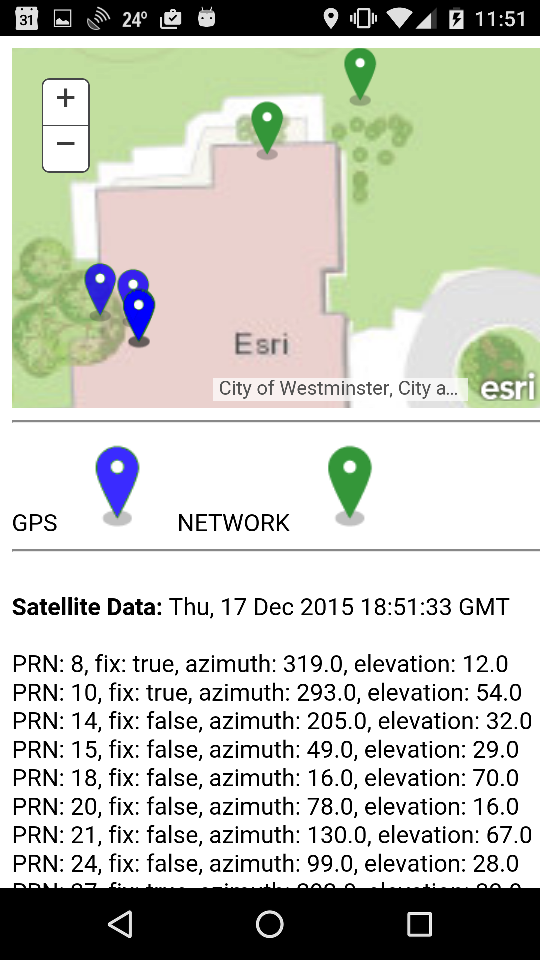

#cordova-plugin-advanced-geolocation (Android-only)

Highly configurable native interface to [GPS](http://developer.android.com/reference/android/location/LocationManager.html#GPS_PROVIDER) and [NETWORK](http://developer.android.com/reference/android/location/LocationManager.html#NETWORK_PROVIDER) on-device [location providers](http://developer.android.com/reference/android/location/LocationProvider.html). It will return and identify any location data registered by the on-device providers including real-time [satellite info](http://developer.android.com/reference/android/location/GpsSatellite.html).

It also offers direct access to [CellInfo](http://developer.android.com/reference/android/telephony/CellInfo.html), [CellLocation](http://developer.android.com/reference/android/telephony/CellLocation.html) and [CellSignalStrength](https://developer.android.com/reference/android/telephony/CellSignalStrength.html) data.

In comparison to the W3C HTML Geolocation API, this plugin provides you with significantly greater control and more information to make better decisions with geolocation data.

If you are experiencing annoying jumping around of your geolocation coordinates then this plugin will help. It seperates GPS from NETWORK coordinates and allows you smooth out the user experience.

This plugin is available via [npm](https://www.npmjs.com/package/cordova-plugin-advanced-geolocation).

##Supported Platforms

**Android-only.** This plugin is designed for Android versions between Android 5.0.0 (Lollipop / API Level 21) and Android 6.x (Marshmallow / API Level 23). 

**IMPORTANT** At Android N (OS version 7) there have been many changes to how GPS is implemented that are not compatible with the current version of this library. See the [issues](https://github.com/Esri/cordova-plugin-advanced-geolocation/issues) list for the most current information.

Cordova supports the following android [releases](https://github.com/apache/cordova-android/releases).

##Quick Start!

Here are the cliff notes for getting started. More details on the Cordova CLI can be found [here](https://cordova.apache.org/docs/en/latest/guide/cli/index.html).

`cordova create cordova-advanced-geolocation com.esri.geo GeoTest`

`cd cordova-advanced-geolocation`

`cordova platform add android`

`cordova platform update android@5.0.0` [choose 5.0.0 or higher]

`cordova plugin add https://github.com/esri/cordova-plugin-advanced-geolocation.git`

In `config.xml` modify the `src` to either ` <content src="sample-map.html" />` or `<content src="sample-leaflet-map.html" />`

`cordova build`

Plug in your phone and run: `cordova run android`, or in Android Studio select `^D`.

##IMPORTANT!

This API does **NOT** conform to the coding patterns described in the W3C Geolocation API Specification. 

Use this plugin to gain significantly greater control and insight into which location provider submitted geolocation data. 

This plugin won't increase device accuracy. Accuracy is heavily dependent on the quality of the GPS antenna and the GPS processor. Most smartphones and tablets use consumer-priced GPS chipsets and micro-strip antennas which under perfect conditions typically return between 3 - 10 meters accuracy, at best. For more information check out this series of [blog posts](http://www.andygup.net/android-gps/). 

External consumer GPS devices may help provide better accuracy, faster location acquisition and less location fluctuation. Here's a good article on [Why Buy an External GPS Antenna?](http://www.ebay.com/gds/Why-Buy-an-External-GPS-Antenna-/10000000177631439/g.html).

If your requirements specifically call for less than 3 meter accuracy then consider using a commercial, external high-accuracy GPS such as the Trimble R1 and slave it to your device via Bluetooth.  

**PRIVACY WARNING** Keep in mind the [W3C security and privacy considerations](http://dev.w3.org/geo/api/spec-source.html#security). This plugin uses native geolocation functionality only. Users will not automatically see a W3C Geolocation prompt, they will only get native Android prompts. The plugin requires the following Android User Permissions: [ACCESS_COARSE_LOCATION](http://developer.android.com/reference/android/Manifest.permission.html#ACCESS_COARSE_LOCATION), [ACCESS_FINE_LOCATION](http://developer.android.com/reference/android/Manifest.permission.html#ACCESS_FINE_LOCATION), [ACCESS_NETWORK_STATE](http://developer.android.com/reference/android/Manifest.permission.html#ACCESS_NETWORK_STATE), [ACCESS_WIFI_STATE](http://developer.android.com/reference/android/Manifest.permission.html#ACCESS_WIFI_STATE) and [INTERNET](http://developer.android.com/reference/android/Manifest.permission.html#INTERNET).

#API Reference

Click [here](api_reference.md) to read all about it.


##Example Usage

```javaScript
    
    // Implement this in `deviceready` event callback
    AdvancedGeolocation.start(function(success){

        try{
            var jsonObject = JSON.parse(success);

            switch(jsonObject.provider){
                case "gps":
					 //TODO
                    break;

                case "network":
					 //TODO
                    break;

                case "satellite":
					 //TODO
                    break;
                    
                case "cell_info":
                	//TODO
                	break;
                	
                case "cell_location":
                	//TODO
                	break;  
                
                case "signal_strength":
                	//TODO
                	break;              	
            }
        }
        catch(exc){
            console.log("Invalid JSON: " + exc);
        }
    },
    function(error){
        console.log("ERROR! " + JSON.stringify(error));
    },
    ////////////////////////////////////////////
    //
    // REQUIRED:
    // These are required Configuration options!
    // See API Reference for additional details.
    //
    ////////////////////////////////////////////
    {
        "minTime":500,         // Min time interval between updates (ms)
        "minDistance":1,       // Min distance between updates (meters)
        "noWarn":true,         // Native location provider warnings
        "providers":"all",     // Return GPS, NETWORK and CELL locations
        "useCache":true,       // Return GPS and NETWORK cached locations
        "satelliteData":false, // Return of GPS satellite info
        "buffer":false,        // Buffer location data
        "bufferSize":0         // Max elements in buffer
        "signalStrength":false // Return cell signal strength data
    });


```

##Use Cases

Here are example use cases for the different ways location providers can be set in the configuration options via the `providers` attribute:

* **`"gps"`** Activates only the GPS provider. Best accuracy where device has an unobstructed view of the sky.
* **`"network"`** Activates only the Network provider. Best accuracy indoors and urban/downtown areas with tall buildings where device does not have an unobstructed view of the sky and cellular service is available and/or WiFi. 
* **`"cell"`** Access only cell network information. 
* **`"all"`** Activates GPS, Network and Cellular providers. Allows you to take advantage of network providers to establish initial location and then use GPS to finalize a more accurate location. Typically the device will provide the network location first before the GPS warms up. After the GPS warms up, and if the accuracy is good enough for your requirements, then you would switch to using the GPS locations. The Cellular provider gives you access to cell tower location information.
* **`"some"`** Activates only GPS and Network providers. Allows you to take advantage of network providers to establish initial location and then use GPS to finalize a more accurate location. Typically the device will provide the network location first before the GPS warms up. After the GPS warms up, and if the accuracy is good enough for your requirements, then you would switch to using the GPS locations.


##Geolocation Data Description

The following geolocation data may be exposed and accessible by this API if the on-device provider is available and enabled:
* Real-time GPS location
* Cached GPS location
* GPS satellites meta data
* Real-time Network location triangulation
* Cached Network location
* Cell tower information (type of information varies by device, OS version and cell service provider)
* Cellular network signal strength

## FAQ

* **Which location providers does this plugin use?** The plugin can be configured to use both [GPS](http://developer.android.com/reference/android/location/LocationManager.html#GPS_PROVIDER) and [NETWORK](http://developer.android.com/reference/android/location/LocationManager.html#NETWORK_PROVIDER) location providers. NETWORK location providers require access to the internet whether it's via cellular or WiFi connection. The plugin does not use [PASSIVE](http://developer.android.com/reference/android/location/LocationManager.html#PASSIVE_PROVIDER) location providers because you have no direct control over those.
* **What is the difference between `CellInfo` and `CellLocation` data?** It can be confusing because they have a lot of overlapping capabilities and may provide slightly different data, as well. They are both focused on providing cell tower information. `CellLocation` is only triggered during an [PhoneStateListener.LISTEN_CELL_LOCATION](http://developer.android.com/reference/android/telephony/PhoneStateListener.html#LISTEN_CELL_LOCATION) event and has two types: [CdmaCellLocation](http://developer.android.com/reference/android/telephony/cdma/CdmaCellLocation.html) and [GsmCellLocation](http://developer.android.com/reference/android/telephony/gsm/GsmCellLocation.html). `CellInfo` contains a sub-set of information focused on the cell tower's id and its signal strength and is derived by querying [TelephonyManager.getAllCellInfo()](http://developer.android.com/reference/android/telephony/TelephonyManager.html#getAllCellInfo()), and there are four different types that are device and provider dependent: [CellInfoCdma](http://developer.android.com/reference/android/telephony/CellInfoCdma.html), [CellInfoWcmda](http://developer.android.com/reference/android/telephony/CellInfoWcdma.html), [CellInfoGsm](http://developer.android.com/reference/android/telephony/CellInfoGsm.html) and [CellInfoLte](http://developer.android.com/reference/android/telephony/CellInfoLte.html). 
* **How is cell signal strength information provided?** There are two ways that signal strength information is derived. The first is when the signal strength changes and the second is when `CellInfo` changes. There are differences in the data that is returned between [SignalStrength](https://developer.android.com/reference/android/telephony/SignalStrength.html) and [CellSignalStrength](https://developer.android.com/reference/android/telephony/CellSignalStrength.html). You will get access to both sets of information depending on what event triggered the change.
* **Will this library work as a background process?** No. This library is **not** designed to be used while minimized. Because of its potential to consume large amounts of memory and CPU cycles it will only provide locations, by default, while the application is in the foreground and active.
* **I got a plugin not supported error, what do I do?** If you get the following error `Plugin doesn't support this project's cordova-android version. cordova-android: 4.1.1, failed version requirement: >=5.0.0
Skipping 'cordova-plugin-advanced-geolocation' for android`, then you most likely need to upgrade your version of cordova-android. You can explicitly upgrade by running the following command in your cordova project directory `cordova platform update android@5.0.0`. 
* **How come this plug-in does not support iOS?** iOS does not give you the same granular-level control over the location manager as does Android. 
* **Does the plugin store location data?** No. The only information it stores intentionally is the `action` setting in the Configuration options. The reason that is stored is so the application can automatically restart after being paused or placed in the background.

## Sample Mapping App

Included with the plugin are two sample mapping apps called `sample-map.html` and `sample-leaflet-map.html`. To use it simply change the following line in your `config.xml` to point to the app's location, for example:

```javscript

   <content src="sample-map.html" />

```



##Licensing

Copyright 2016 Esri

Licensed under the Apache License, Version 2.0 (the "License"); you may not use this file except in compliance with the License. You may obtain a copy of the License at

[http://www.apache.org/licenses/LICENSE-2.0](http://www.apache.org/licenses/LICENSE-2.0)

Unless required by applicable law or agreed to in writing, software distributed under the License is distributed on an "AS IS" BASIS, WITHOUT WARRANTIES OR CONDITIONS OF ANY KIND, either express or implied. See the License for the specific language governing permissions and limitations under the License.

A copy of the license is available in the repository's [license.txt]( license.txt) file.

[](Esri Tags: JavaScript HTML5 GPS Geolocation ArcGIS Location Tools Cordova PhoneGap)
[](Esri Language: JavaScript)


